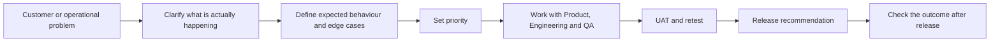

# Product Requirements to Release

Most of the product work I have done started with something imperfect: a customer could not get the expected result, an operating team was working around a problem, or a requirement was too vague for Engineering and QA to test consistently.

My part was to make the problem clear, document what should happen, help set the priority, and stay involved through testing and release follow-up.

## How the work moved

I did not treat every complaint as a product change. Sometimes the issue belonged in the product. Other times the better answer was a service, process, setup, or communication change. The first job was to understand which problem we were actually solving.

## Work samples

### 1. Requirement review

A representative example of how I review a vague requirement and make the expected behaviour testable before development or release.

[See the requirement brief →](examples/requirement-brief.md)

### 2. Prioritization

A practical example of how I compare issues using customer impact, recurrence, operational consequence, available workaround, and delivery dependency instead of treating every request as equally urgent.

[See the prioritization example →](examples/prioritization-example.md)

### 3. UAT and release review

A representative example of how I compare the original scenario with the expected result, record the gap, retest after a change, and make a release recommendation based on evidence.

[See the UAT and release review →](examples/uat-and-release-review.md)

## What I look for before calling a requirement ready

- Is the actual customer or operational problem clear?
- Can Engineering understand what needs to change without guessing?
- Can QA test the expected result objectively?
- Are important edge cases included?
- Is the priority tied to impact rather than who asked most recently?
- Is there a clear way to check whether the change worked after release?

## My role in this work

I was not the engineer building the change. I worked close to customers and operations, carried that context into product discussions, reviewed requirements for ambiguity, coordinated with Product, Engineering, and QA, supported UAT, and stayed involved until the result could be checked in the original customer scenario.

The examples in this repository are generalized from real work. They do not contain confidential client information, internal product documentation, or proprietary technical details.

## Author

**Shaibal Barman**  
[LinkedIn](https://www.linkedin.com/in/shaibal-barman) · [Portfolio](https://shaibal-portfolio.brmnshaibal.workers.dev/)
