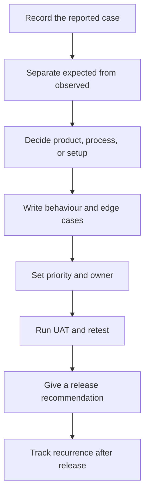

# Product Requirements to Release

My work on product requirements began when the system returned the wrong result for a customer, the operations team needed a manual workaround, or Engineering and QA read the same requirement differently.

I documented the original case, wrote down what should have happened and what the system returned, helped rank competing issues, tested changes in customer workflows, coordinated retesting with QA, and checked whether the release solved the reported problem.

## Workflow I followed

A complaint did not automatically become an Engineering task. I first checked whether the cause came from product behaviour, configuration, service process, ownership, or communication. That showed who needed to act and what evidence would prove the issue was resolved.

## Work samples

### 1. Requirement review

Shows how I replaced the undefined words “correct” and “timely” in an AI-detection requirement with test conditions, acceptance criteria, and the evidence needed before release.

[See the requirement brief →](examples/requirement-brief.md)

### 2. Prioritization

Shows how I ordered three competing issues: repeated detection errors, an escalation with no named owner, and a one-time request with a working alternative.

[See the prioritization record →](examples/prioritization-example.md)

### 3. UAT and release review

Shows how I returned to the reported customer scenario, compared expected and observed behaviour, retested the change, and made a release-readiness decision.

[See the UAT and release review →](examples/uat-and-release-review.md)

## Questions I asked before recommending a requirement as ready

- Could another person reproduce the reported case from the evidence provided?
- Were the expected and observed results written separately?
- Did each timing or accuracy term have a defined target and measurement method?
- Could QA mark each acceptance criterion as pass or fail without interpreting the wording?
- Did the test set include previously failing scenarios and known edge cases?
- Were the owner and delivery dependencies named?
- Did we know what to check after release—repeat complaints, mismatch rate, or continued use of a workaround?

## My role

I did not write production code. I reviewed requirements from the customer and operations side, flagged unclear timing and missing scenarios before development, documented object and colour mismatches, worked with Product, Engineering, and QA, tested changes in customer workflows, retested fixes, and made a release recommendation from the test results.

I wrote these samples from work I handled; they are not copies of employer documents. I left out customer and product names, screenshots, internal targets, and proprietary specifications.

## Author

**Shaibal Barman**  
[LinkedIn](https://www.linkedin.com/in/shaibal-barman) · [Portfolio](https://shaibal-portfolio.brmnshaibal.workers.dev/)
