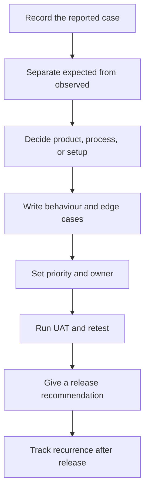

# Product Requirements to Release

Issues reached me as wrong customer results, operations workarounds, or requirements that Engineering and QA interpreted differently.

My responsibility was to document the original scenario, separate expected from observed behaviour, rank competing issues, test proposed changes in customer workflows, coordinate retesting with QA, and check whether the released change solved the reported problem.

## Workflow I followed

A complaint did not automatically become an Engineering task. I checked whether the gap came from product behaviour, configuration, a service process, unclear ownership, or communication. That decision identified the owner, next action, and evidence needed for closure.

## Work samples

### 1. Requirement review

Starts with an AI-detection requirement containing two undefined words—“correct” and “timely”—then adds the missing test conditions, acceptance criteria, and release evidence.

[See the requirement brief →](examples/requirement-brief.md)

### 2. Prioritization

Compares three competing issues: repeated detection errors, unclear escalation ownership, and a one-time request with a working alternative. It records why each issue received its place in the queue.

[See the prioritization record →](examples/prioritization-example.md)

### 3. UAT and release review

Follows a reported detection problem from expected-versus-observed behaviour through retesting and a release-readiness decision.

[See the UAT and release review →](examples/uat-and-release-review.md)

## Checks I used before recommending a requirement as ready

- Is the reported case documented with enough evidence for another person to reproduce it?
- Are the expected and observed results written separately?
- Does every timing or accuracy term have a defined target and measurement method?
- Can QA mark each acceptance criterion as pass or fail without interpreting the wording?
- Do the test cases include previously failing scenarios and known edge cases?
- Are the owner and delivery dependencies named?
- Is the post-release signal defined, such as a repeat complaint, mismatch rate, or continued workaround?

## My role

I did not write production code. I reviewed requirements from the customer and operations side, flagged unclear timing and missing scenarios before development, documented object and colour mismatches, worked with Product, Engineering, and QA, tested changes in customer workflows, retested fixes, and shared a release-readiness recommendation.

These files are reconstructed work samples, not copies of an employer’s documents. Customer names, product names, screenshots, internal targets, and proprietary specifications are omitted. The problem-solving steps and decision criteria reflect work I handled.

## Author

**Shaibal Barman**  
[LinkedIn](https://www.linkedin.com/in/shaibal-barman) · [Portfolio](https://shaibal-portfolio.brmnshaibal.workers.dev/)
